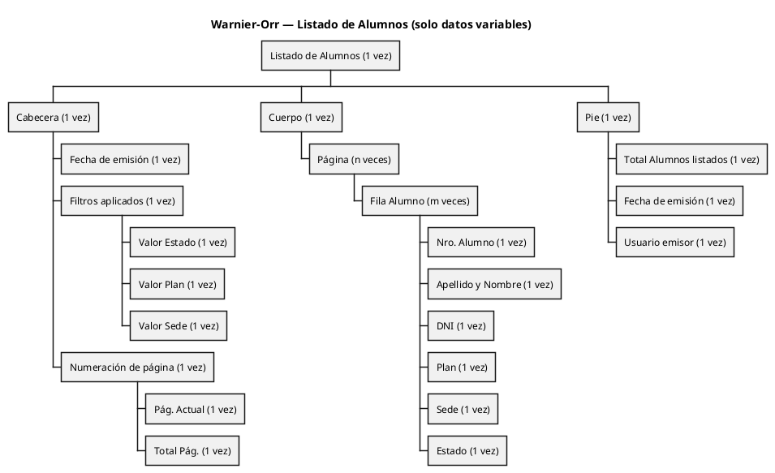
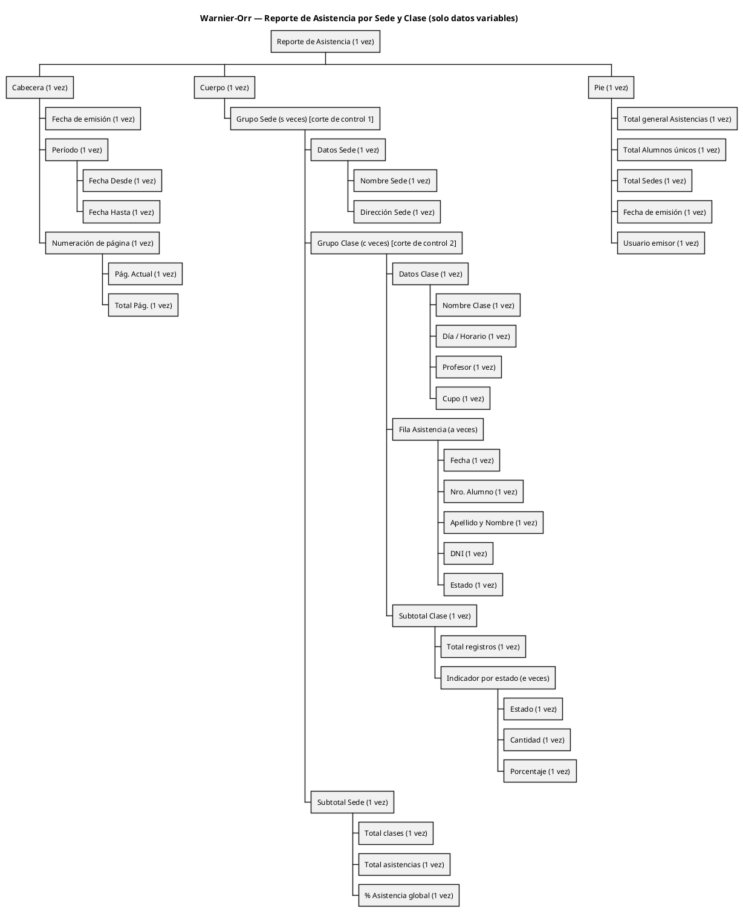

# Diagramas Warnier-Orr y Layouts — SquatGym

**Módulo:** xiii — Gestión de Alumnos y Clases
**Enfoque:** Estructural y jerárquico (Warnier-Orr + Layout), según el material de cátedra *Guía TP1 — Diseño de Entradas-Salidas*.
**Criterio de descomposición:** Cabecera → Cuerpo → Pie, con multiplicidades explícitas (`(1 vez)`, `(n veces)`, `(m veces)`) y OR-exclusivo (`⊕`) cuando corresponde.

### Reglas aplicadas al Warnier-Orr

1. **Solo información variable o repetible.** Se representan valores que provienen del diccionario de datos y cambian en cada emisión del reporte. Se excluyen literales fijos, etiquetas de columna, títulos constantes, logos y cualquier elemento cuya presencia no varíe. Estos constantes se muestran únicamente en el **Layout**.

2. **No enumerar dominios abiertos.** Los valores concretos de un campo no se listan cuando el dominio puede escalar con el tiempo (por ejemplo, `Sede` puede crecer a más sucursales; `Estado` o `Plan` pueden agregar categorías en el futuro). En esos casos se deja el campo como un único nodo variable. El operador `⊕` solo se reserva para dominios cerrados por regla de negocio (ej. Debe / Haber).

Los reportes se cubren en dos bloques. Para cada uno:

1. **Diagrama Warnier-Orr** — árbol ASCII (fiel al formato del material).
2. **Diagrama Warnier-Orr (renderizable)** — PlantUML WBS equivalente.
3. **Layout** — distribución estructural; `[______]` para datos variables, texto sin cubeta para etiquetas constantes.

---

# REPORTE 1 — LISTADO DE ALUMNOS (reporte simple)

Reporte operativo para Administrador / Secretaría. Emite la nómina completa de alumnos según filtros (Estado, Plan, Sede). No posee cortes de control.

---

## 1.1 Diagrama Warnier-Orr — Listado de Alumnos

```text
Listado_Alumnos (1 vez)
│
├── Cabecera (1 vez)
│   ├── Fecha de emisión (1 vez)
│   ├── Filtros aplicados (1 vez)
│   │   ├── Valor Estado (1 vez)
│   │   ├── Valor Plan   (1 vez)
│   │   └── Valor Sede   (1 vez)
│   └── Numeración de página (1 vez)
│       ├── Pág. Actual (1 vez)
│       └── Total Pág.  (1 vez)
│
├── Cuerpo (1 vez)
│   │
│   └── Página (n veces)
│       │
│       └── Fila Alumno (m veces)
│           ├── Nro. Alumno       (1 vez)
│           ├── Apellido y Nombre (1 vez)
│           ├── DNI               (1 vez)
│           ├── Plan              (1 vez)
│           ├── Sede              (1 vez)
│           └── Estado            (1 vez)
│
└── Pie (1 vez)
    ├── Total Alumnos listados (1 vez)
    ├── Fecha de emisión       (1 vez)
    └── Usuario emisor         (1 vez)
```

---

## 1.2 Diagrama Warnier-Orr (renderizable) — Listado de Alumnos



---

## 1.3 Layout — Listado de Alumnos

Distribución estructural en hoja A4, orientación vertical. Las `[______]` son cubetas para datos variables (las que aparecen en el Warnier-Orr); el texto sin cubeta es información constante (no aparece en el Warnier-Orr).

```text
┌──────────────────────────────────────────────────────────────────────────────┐
│ [Logo]                                                  Pág. [__] / [__]     │  <- CABECERA
│                                                                              │
│                       Listado de Alumnos                                     │
│                       Emitido el: [__/__/____]                               │
│                                                                              │
│  Filtros — Estado: [_______]    Plan: [_______]    Sede: [_______]           │
├──────────────────────────────────────────────────────────────────────────────┤
│  Nro    Apellido y Nombre              DNI           Plan      Sede   Estado │  <- Etiquetas
│                                                                              │     (constantes)
├──────────────────────────────────────────────────────────────────────────────┤
│ [___]  [__________________]          [_________]    [_____]   [____] [_____] │  <- CUERPO
│ [___]  [__________________]          [_________]    [_____]   [____] [_____] │     Fila Alumno
│ [___]  [__________________]          [_________]    [_____]   [____] [_____] │     (m veces)
│ [___]  [__________________]          [_________]    [_____]   [____] [_____] │
│   ...                                                                        │
│ [___]  [__________________]          [_________]    [_____]   [____] [_____] │
│                                                                              │
├──────────────────────────────────────────────────────────────────────────────┤
│                                            Total Alumnos listados: [____]    │  <- PIE
│                                                                              │
│  Emitido por: [__________________]             Fecha: [__/__/____]           │
└──────────────────────────────────────────────────────────────────────────────┘
```

**Correspondencia Warnier-Orr ↔ Layout (Reporte 1)**

- Cada **cubeta** del layout se corresponde con un **nodo hoja** del Warnier-Orr.
- Los literales visibles en el layout (título "Listado de Alumnos", etiquetas "Nro", "Apellido y Nombre", "DNI", "Plan", "Sede", "Estado", "Filtros —", "Total Alumnos listados:", "Emitido por:", "Fecha:", logo) NO aparecen en el Warnier-Orr porque son constantes.
- La iteración `Página (n veces)` del Warnier-Orr se materializa en la paginación del layout (mismo encabezado repetido en cada página).
- La iteración `Fila Alumno (m veces)` se materializa en las filas apiladas de la grilla central.

---

# REPORTE 2 — ASISTENCIA POR SEDE Y CLASE (con corte de control)

Reporte analítico que agrupa los registros de asistencia por **Sede** (corte de control primario) y dentro de cada sede por **Clase** (corte secundario), con subtotales por nivel.

---

## 2.1 Diagrama Warnier-Orr — Asistencia por Sede y Clase

```text
Reporte_Asistencia (1 vez)
│
├── Cabecera (1 vez)
│   ├── Fecha de emisión (1 vez)
│   ├── Período (1 vez)
│   │   ├── Fecha Desde (1 vez)
│   │   └── Fecha Hasta (1 vez)
│   └── Numeración de página (1 vez)
│       ├── Pág. Actual (1 vez)
│       └── Total Pág.  (1 vez)
│
├── Cuerpo (1 vez)
│   │
│   └── Grupo Sede (s veces)                       ← CORTE DE CONTROL 1
│       │
│       ├── Datos Sede (1 vez)
│       │   ├── Nombre Sede    (1 vez)
│       │   └── Dirección Sede (1 vez)
│       │
│       ├── Grupo Clase (c veces)                  ← CORTE DE CONTROL 2
│       │   │
│       │   ├── Datos Clase (1 vez)
│       │   │   ├── Nombre Clase  (1 vez)
│       │   │   ├── Día / Horario (1 vez)
│       │   │   ├── Profesor      (1 vez)
│       │   │   └── Cupo          (1 vez)
│       │   │
│       │   ├── Fila Asistencia (a veces)
│       │   │   ├── Fecha             (1 vez)
│       │   │   ├── Nro. Alumno       (1 vez)
│       │   │   ├── Apellido y Nombre (1 vez)
│       │   │   ├── DNI               (1 vez)
│       │   │   └── Estado            (1 vez)
│       │   │
│       │   └── Subtotal Clase (1 vez)
│       │       ├── Total registros (1 vez)
│       │       └── Indicador por estado (e veces)
│       │           ├── Estado     (1 vez)
│       │           ├── Cantidad   (1 vez)
│       │           └── Porcentaje (1 vez)
│       │
│       └── Subtotal Sede (1 vez)
│           ├── Total clases        (1 vez)
│           ├── Total asistencias   (1 vez)
│           └── % Asistencia global (1 vez)
│
└── Pie (1 vez)
    ├── Total general Asistencias (1 vez)
    ├── Total Alumnos únicos      (1 vez)
    ├── Total Sedes               (1 vez)
    ├── Fecha de emisión          (1 vez)
    └── Usuario emisor            (1 vez)
```

---

## 2.2 Diagrama Warnier-Orr (renderizable) — Asistencia por Sede y Clase



---

## 2.3 Layout — Asistencia por Sede y Clase

Distribución estructural con los dos niveles de corte bien delimitados. El bloque `SEDE` se repite s veces; dentro de cada sede, el bloque `CLASE` se repite c veces; dentro de cada clase, la fila de asistencia se repite a veces.

```text
┌──────────────────────────────────────────────────────────────────────────────┐
│ [Logo]                                                  Pág. [__] / [__]     │  <- CABECERA
│                                                                              │     general
│                Reporte de Asistencia por Sede y Clase                        │
│                Emitido el: [__/__/____]                                      │
│                                                                              │
│  Período — Desde: [__/__/____]      Hasta: [__/__/____]                      │
├══════════════════════════════════════════════════════════════════════════════┤
│  ▼ SEDE: [__________________]        Dirección: [__________________]         │  <- CORTE 1
│                                                                              │     (Grupo Sede)
│  ┌────────────────────────────────────────────────────────────────────────┐ │
│  │ ▶ CLASE: [_____________]  Horario: [________]  Prof: [____________]    │ │  <- CORTE 2
│  │   Cupo: [___]                                                          │ │     (Grupo Clase)
│  ├────────────────────────────────────────────────────────────────────────┤ │
│  │   Fecha        Nro     Apellido y Nombre         DNI          Estado   │ │  <- Etiquetas
│  ├────────────────────────────────────────────────────────────────────────┤ │     (constantes)
│  │ [__/__/____]  [___]  [_________________]    [_________]     [_______]  │ │  <- Fila Asist.
│  │ [__/__/____]  [___]  [_________________]    [_________]     [_______]  │ │     (a veces)
│  │   ...                                                                  │ │
│  ├────────────────────────────────────────────────────────────────────────┤ │
│  │ Subtotal CLASE:  Registros [____]   [estado]:[__]  [estado]:[__]  …    │ │  <- Subtotal
│  └────────────────────────────────────────────────────────────────────────┘ │     clase
│                                                                              │
│  ┌────────────────────────────────────────────────────────────────────────┐ │
│  │ ▶ CLASE: [_____________]  Horario: [________]  Prof: [____________]    │ │
│  │   ...                                                                  │ │
│  └────────────────────────────────────────────────────────────────────────┘ │
│                                                                              │
│  ═══════════════════════════════════════════════════════════════════════    │
│  Subtotal SEDE:  Clases [____]  Asistencias [____]  % Global [____]         │  <- Subtotal
│  ═══════════════════════════════════════════════════════════════════════    │     sede
│                                                                              │
│  ▼ SEDE: [__________________]        Dirección: [__________________]         │
│    ...                                                                       │
│                                                                              │
├══════════════════════════════════════════════════════════════════════════════┤
│  TOTAL GENERAL                                                               │  <- PIE
│    Asistencias registradas: [______]                                         │
│    Alumnos únicos:          [______]                                         │
│    Sedes procesadas:        [______]                                         │
│                                                                              │
│  Emitido por: [__________________]             Fecha: [__/__/____]           │
└──────────────────────────────────────────────────────────────────────────────┘
```

**Correspondencia Warnier-Orr ↔ Layout (Reporte 2)**

- Cada **cubeta** del layout se corresponde con un **nodo hoja** del Warnier-Orr.
- Los literales del layout (título del reporte, "Período — Desde:", "Hasta:", "SEDE:", "Dirección:", "CLASE:", "Horario:", "Prof:", "Cupo:", etiquetas de columnas, "Subtotal CLASE:", "Subtotal SEDE:", "TOTAL GENERAL", "Emitido por:", logo, separadores) NO aparecen en el Warnier-Orr porque son constantes.
- El bloque `▼ SEDE … ═ Subtotal SEDE ═` materializa la iteración `Grupo Sede (s veces)`.
- Cada recuadro `▶ CLASE … Subtotal CLASE` materializa `Grupo Clase (c veces)`.
- Las filas internas materializan `Fila Asistencia (a veces)`.

---

## Apéndice — Convenciones utilizadas

| Símbolo / notación | Significado |
|---|---|
| `(1 vez)` | Secuencia: el elemento aparece exactamente una vez en cada instancia de su contenedor. |
| `(n veces)`, `(m veces)`, `(s veces)`, `(c veces)`, `(a veces)` | Iteración: repetición; cada cardinalidad es nombrada para evitar ambigüedad cuando hay anidación. |
| `⊕` | OR-exclusivo (alternativa): uno y solo uno de los elementos listados. Reservado para dominios cerrados por regla de negocio (por ejemplo, Debe/Haber). No se usa para campos cuyo dominio puede ampliarse (Sede, Estado, Plan). |
| `(0,1 vez)` | Opcional dentro de una alternativa exclusiva. |
| `(e veces)` | Iteración sobre el conjunto de categorías del campo (en este reporte, cantidad de estados definidos). Evita hardcodear la enumeración. |
| `[______]` | Cubeta del layout — espacio reservado para **dato variable** (con correspondencia en el Warnier-Orr). |
| Texto sin cubeta en el layout | **Dato constante** / etiqueta del informe (NO aparece en el Warnier-Orr). |

## Render de los diagramas WBS

Los bloques `@startwbs ... @endwbs` se renderizan en:

- PlantUML online: https://www.plantuml.com/plantuml/uml/
- VS Code con la extensión *PlantUML* (jebbs.plantuml) → Alt+D sobre el bloque.
