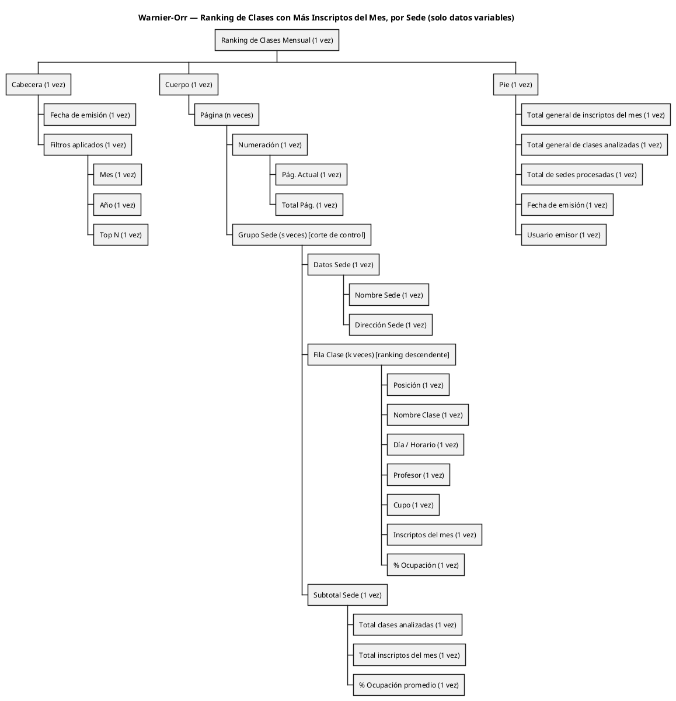
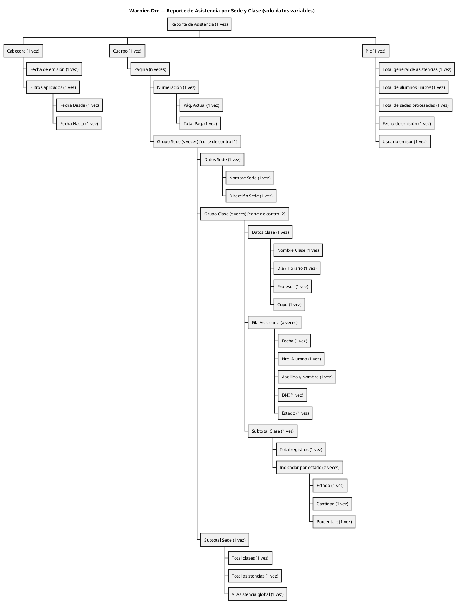

# Diagramas Warnier-Orr y Layouts — SquatGym

**Módulo:** xiii — Gestión de Alumnos y Clases
**Enfoque:** Estructural y jerárquico (Warnier-Orr + Layout), según el material de cátedra *Guía TP1 — Diseño de Entradas-Salidas* (UTN FRRe).

## Pilares aplicados al diseño de los reportes

1. **Discriminación y agrupamiento (cortes de control).** Ambos reportes están discriminados por categoría clave — no son listas planas. El Reporte 1 (ranking de clases más inscriptas) corta por **Sede**; el Reporte 2 (asistencia) corta por **Sede** y, dentro de cada sede, por **Clase**.
2. **Filtros de temporalidad.** El Reporte 1 se acota por **Mes / Año** específico; el Reporte 2 por **rango Fecha Desde / Fecha Hasta**.
3. **Información de gestión (totales y subtotales).** Cada corte produce su subtotal; el Pie del reporte contiene el total general. El Reporte 1 es, además, un reporte de KPI (posición, % ocupación) orientado a toma de decisiones.
4. **Jerarquía en Warnier-Orr.** `Raíz → (Cabecera | Cuerpo | Pie) → Cuerpo · Página (n veces) → Grupos de corte → Campos atómicos`.
5. **Atributos funcionales del reporte.** Encabezados de columna, fecha de elaboración, numeración de páginas y etiquetas para cada cubeta aparecen en el **Layout** (no en el Warnier-Orr, porque son constantes).
6. **Diferenciación de salida.** Los dos reportes de este módulo son de **uso interno** (gestión administrativa): se diseñan con distribución clara y sobria. Si un reporte fuera externo (p. ej. comprobante entregado al alumno), se sumarían logo institucional, colores, instrucciones y datos legales de la organización.

## Reglas aplicadas al Warnier-Orr

- **Solo información variable.** Etiquetas de columna, títulos constantes, logos y separadores no aparecen en el Warnier-Orr; se muestran únicamente en el Layout.
- **No enumerar dominios abiertos.** Los valores concretos de campos que pueden escalar (Sede, Plan, Estado) no se listan como alternativas: se dejan como un nodo variable. El operador `⊕` se reserva para dominios cerrados por regla de negocio (p. ej. Debe/Haber).

Para cada reporte se presenta: **(1)** Warnier-Orr en árbol ASCII, **(2)** Warnier-Orr renderizable en PlantUML WBS y **(3)** Layout estructural.

---

# REPORTE 1 — RANKING DE CLASES CON MÁS INSCRIPTOS DEL MES, POR SEDE

**Propósito.** Identificar las clases con mayor cantidad de inscriptos en un mes dado, discriminando por Sede. Reporte de gestión para decisiones de negocio (replicar clases exitosas, reasignar profesores, cerrar o reformular horarios con baja ocupación).
**Destinatario.** Administrador (uso interno).
**Corte de control.** Sede.
**Filtros.** Mes y Año (temporalidad por mes específico); Top N (cantidad de clases a rankear por sede).

---

## 1.1 Diagrama Warnier-Orr — Ranking de Clases por Sede

```text
Ranking_Clases_Mensual (1 vez)
│
├── Cabecera (1 vez)
│   ├── Fecha de emisión (1 vez)
│   └── Filtros aplicados (1 vez)
│       ├── Mes   (1 vez)
│       ├── Año   (1 vez)
│       └── Top N (1 vez)
│
├── Cuerpo (1 vez)
│   │
│   └── Página (n veces)
│       │
│       ├── Numeración (1 vez)
│       │   ├── Pág. Actual (1 vez)
│       │   └── Total Pág.  (1 vez)
│       │
│       └── Grupo Sede (s veces)                  ← CORTE DE CONTROL
│           │
│           ├── Datos Sede (1 vez)
│           │   ├── Nombre Sede    (1 vez)
│           │   └── Dirección Sede (1 vez)
│           │
│           ├── Fila Clase (k veces)              ← ranking ordenado desc.
│           │   ├── Posición              (1 vez)
│           │   ├── Nombre Clase          (1 vez)
│           │   ├── Día / Horario         (1 vez)
│           │   ├── Profesor              (1 vez)
│           │   ├── Cupo                  (1 vez)
│           │   ├── Inscriptos del mes    (1 vez)
│           │   └── % Ocupación           (1 vez)
│           │
│           └── Subtotal Sede (1 vez)
│               ├── Total clases analizadas   (1 vez)
│               ├── Total inscriptos del mes  (1 vez)
│               └── % Ocupación promedio      (1 vez)
│
└── Pie (1 vez)
    ├── Total general de inscriptos del mes (1 vez)
    ├── Total general de clases analizadas  (1 vez)
    ├── Total de sedes procesadas           (1 vez)
    ├── Fecha de emisión                    (1 vez)
    └── Usuario emisor                      (1 vez)
```

---

## 1.2 Diagrama Warnier-Orr (renderizable) — Ranking de Clases por Sede



---

## 1.3 Layout — Ranking de Clases por Sede

Distribución estructural en hoja A4, orientación vertical. Las `[______]` son cubetas para datos variables (corresponden a los nodos hoja del Warnier-Orr); el texto sin cubeta es información constante (etiquetas fijas que no aparecen en el Warnier-Orr).

```text
┌──────────────────────────────────────────────────────────────────────────────┐
│ [Logo]                                                  Pág. [__] / [__]     │  <- CABECERA
│                                                                              │     general
│          Ranking de Clases con Más Inscriptos del Mes                        │
│          Emitido el: [__/__/____]                                            │
│                                                                              │
│  Mes: [________]     Año: [____]     Top: [__] clases por sede               │
├══════════════════════════════════════════════════════════════════════════════┤
│  ▼ SEDE: [__________________]        Dirección: [__________________]         │  <- CORTE
│                                                                              │     Grupo Sede
│  ┌────────────────────────────────────────────────────────────────────────┐ │
│  │ Pos   Clase               Horario     Profesor        Cupo  Insc   %Oc │ │  <- Etiquetas
│  ├────────────────────────────────────────────────────────────────────────┤ │     (constantes)
│  │ [__] [_______________]  [_________]  [____________]  [___] [___] [___] │ │  <- Fila Clase
│  │ [__] [_______________]  [_________]  [____________]  [___] [___] [___] │ │     (k veces,
│  │ [__] [_______________]  [_________]  [____________]  [___] [___] [___] │ │      top-k desc.)
│  │   ...                                                                  │ │
│  └────────────────────────────────────────────────────────────────────────┘ │
│                                                                              │
│  Subtotal SEDE:                                                              │  <- Subtotal
│    Clases analizadas: [____]   Inscriptos del mes: [____]                    │     Sede
│    % Ocupación promedio: [___]%                                              │
│                                                                              │
│  ▼ SEDE: [__________________]        Dirección: [__________________]         │
│    ...                                                                       │
│                                                                              │
├══════════════════════════════════════════════════════════════════════════════┤
│  TOTAL GENERAL                                                               │  <- PIE
│    Inscriptos del mes:    [______]                                           │
│    Clases analizadas:     [______]                                           │
│    Sedes procesadas:      [______]                                           │
│                                                                              │
│  Emitido por: [__________________]             Fecha: [__/__/____]           │
└──────────────────────────────────────────────────────────────────────────────┘
```

**Correspondencia Warnier-Orr ↔ Layout (Reporte 1)**

- Título fijo, logo, etiquetas de columna (`Pos`, `Clase`, `Horario`, `Profesor`, `Cupo`, `Insc`, `%Oc`), `Mes:`, `Año:`, `Top:`, `SEDE:`, `Dirección:`, `Subtotal SEDE:`, `TOTAL GENERAL`, separadores: aparecen solo en el Layout (son constantes).
- El bloque `▼ SEDE … Subtotal SEDE` materializa `Grupo Sede (s veces)`; la grilla interna materializa `Fila Clase (k veces)`, ordenada por `Inscriptos del mes` descendente.
- La paginación (cabecera + numeración repetida en cada hoja) materializa `Página (n veces)`.
- La `Posición` se calcula en tiempo de generación a partir del orden del ranking.

---

# REPORTE 2 — ASISTENCIA POR SEDE Y CLASE

**Propósito.** Emitir el detalle de asistencias registradas en un período, discriminado por Sede y Clase, con indicadores de gestión por nivel.
**Destinatario.** Administrador / Encargado (uso interno).
**Cortes de control.** Sede (primario) → Clase (secundario).
**Filtros.** Período (Fecha Desde / Fecha Hasta).

---

## 2.1 Diagrama Warnier-Orr — Asistencia por Sede y Clase

```text
Reporte_Asistencia (1 vez)
│
├── Cabecera (1 vez)
│   ├── Fecha de emisión (1 vez)
│   └── Filtros aplicados (1 vez)
│       ├── Fecha Desde (1 vez)
│       └── Fecha Hasta (1 vez)
│
├── Cuerpo (1 vez)
│   │
│   └── Página (n veces)
│       │
│       ├── Numeración (1 vez)
│       │   ├── Pág. Actual (1 vez)
│       │   └── Total Pág.  (1 vez)
│       │
│       └── Grupo Sede (s veces)                  ← CORTE DE CONTROL 1
│           │
│           ├── Datos Sede (1 vez)
│           │   ├── Nombre Sede    (1 vez)
│           │   └── Dirección Sede (1 vez)
│           │
│           ├── Grupo Clase (c veces)             ← CORTE DE CONTROL 2
│           │   │
│           │   ├── Datos Clase (1 vez)
│           │   │   ├── Nombre Clase  (1 vez)
│           │   │   ├── Día / Horario (1 vez)
│           │   │   ├── Profesor      (1 vez)
│           │   │   └── Cupo          (1 vez)
│           │   │
│           │   ├── Fila Asistencia (a veces)
│           │   │   ├── Fecha             (1 vez)
│           │   │   ├── Nro. Alumno       (1 vez)
│           │   │   ├── Apellido y Nombre (1 vez)
│           │   │   ├── DNI               (1 vez)
│           │   │   └── Estado            (1 vez)
│           │   │
│           │   └── Subtotal Clase (1 vez)
│           │       ├── Total registros (1 vez)
│           │       └── Indicador por estado (e veces)
│           │           ├── Estado     (1 vez)
│           │           ├── Cantidad   (1 vez)
│           │           └── Porcentaje (1 vez)
│           │
│           └── Subtotal Sede (1 vez)
│               ├── Total clases         (1 vez)
│               ├── Total asistencias    (1 vez)
│               └── % Asistencia global  (1 vez)
│
└── Pie (1 vez)
    ├── Total general de asistencias (1 vez)
    ├── Total de alumnos únicos      (1 vez)
    ├── Total de sedes procesadas    (1 vez)
    ├── Fecha de emisión             (1 vez)
    └── Usuario emisor               (1 vez)
```

---

## 2.2 Diagrama Warnier-Orr (renderizable) — Asistencia por Sede y Clase



---

## 2.3 Layout — Asistencia por Sede y Clase

Distribución estructural con los dos niveles de corte bien delimitados. El bloque `SEDE` se repite s veces; dentro de cada sede, el bloque `CLASE` se repite c veces; dentro de cada clase, la fila de asistencia se repite a veces.

```text
┌──────────────────────────────────────────────────────────────────────────────┐
│ [Logo]                                                  Pág. [__] / [__]     │  <- CABECERA
│                                                                              │     general
│                Reporte de Asistencia por Sede y Clase                        │
│                Emitido el: [__/__/____]                                      │
│                                                                              │
│  Período — Desde: [__/__/____]      Hasta: [__/__/____]                      │
├══════════════════════════════════════════════════════════════════════════════┤
│  ▼ SEDE: [__________________]        Dirección: [__________________]         │  <- CORTE 1
│                                                                              │     Grupo Sede
│  ┌────────────────────────────────────────────────────────────────────────┐ │
│  │ ▶ CLASE: [_____________]  Horario: [________]  Prof: [____________]    │ │  <- CORTE 2
│  │   Cupo: [___]                                                          │ │     Grupo Clase
│  ├────────────────────────────────────────────────────────────────────────┤ │
│  │   Fecha        Nro     Apellido y Nombre         DNI          Estado   │ │  <- Etiquetas
│  ├────────────────────────────────────────────────────────────────────────┤ │     (constantes)
│  │ [__/__/____]  [___]  [_________________]    [_________]     [_______]  │ │  <- Fila Asist.
│  │ [__/__/____]  [___]  [_________________]    [_________]     [_______]  │ │     (a veces)
│  │   ...                                                                  │ │
│  ├────────────────────────────────────────────────────────────────────────┤ │
│  │ Subtotal CLASE:  Registros [____]   [estado]:[__]  [estado]:[__]  …    │ │  <- Subtotal
│  └────────────────────────────────────────────────────────────────────────┘ │     Clase
│                                                                              │
│  ┌────────────────────────────────────────────────────────────────────────┐ │
│  │ ▶ CLASE: [_____________]  Horario: [________]  Prof: [____________]    │ │
│  │   ...                                                                  │ │
│  └────────────────────────────────────────────────────────────────────────┘ │
│                                                                              │
│  ═══════════════════════════════════════════════════════════════════════    │
│  Subtotal SEDE:  Clases [____]  Asistencias [____]  % Global [____]         │  <- Subtotal
│  ═══════════════════════════════════════════════════════════════════════    │     Sede
│                                                                              │
│  ▼ SEDE: [__________________]        Dirección: [__________________]         │
│    ...                                                                       │
│                                                                              │
├══════════════════════════════════════════════════════════════════════════════┤
│  TOTAL GENERAL                                                               │  <- PIE
│    Asistencias registradas: [______]                                         │
│    Alumnos únicos:          [______]                                         │
│    Sedes procesadas:        [______]                                         │
│                                                                              │
│  Emitido por: [__________________]             Fecha: [__/__/____]           │
└──────────────────────────────────────────────────────────────────────────────┘
```

**Correspondencia Warnier-Orr ↔ Layout (Reporte 2)**

- Título fijo, logo, `Período —`, `Desde:`, `Hasta:`, `SEDE:`, `Dirección:`, `CLASE:`, `Horario:`, `Prof:`, `Cupo:`, encabezados de columna, `Subtotal CLASE:`, `Subtotal SEDE:`, `TOTAL GENERAL`: constantes presentes solo en el Layout.
- El bloque `▼ SEDE … Subtotal SEDE` materializa `Grupo Sede (s veces)`.
- El bloque `▶ CLASE … Subtotal CLASE` materializa `Grupo Clase (c veces)`.
- Las filas de la grilla interna materializan `Fila Asistencia (a veces)`.
- La paginación (cabecera + numeración repetida en cada hoja) materializa `Página (n veces)`.

---

## Apéndice — Convenciones utilizadas

| Símbolo / notación | Significado |
|---|---|
| `(1 vez)` | Secuencia: el elemento aparece exactamente una vez en cada instancia de su contenedor. |
| `(n veces)`, `(m veces)`, `(s veces)`, `(c veces)`, `(a veces)` | Iteración nombrada por contexto (páginas, filas de alumno, sedes, clases, asistencias). |
| `(e veces)` | Iteración sobre las categorías del campo (cantidad de estados definidos); evita hardcodear el dominio. |
| `⊕` | OR-exclusivo (alternativa). Reservado para dominios cerrados por regla de negocio (p. ej. Debe/Haber); no se usa para Sede, Estado, Plan, que pueden ampliarse. |
| `[______]` | Cubeta del layout — espacio reservado para **dato variable** (tiene nodo hoja en el Warnier-Orr). |
| Texto sin cubeta | **Dato constante** / etiqueta. No aparece en el Warnier-Orr. |

## Checklist de pilares — cobertura de los dos reportes

| Pilar de cátedra | Reporte 1 — Ranking de Clases | Reporte 2 — Asistencia |
|---|---|---|
| Discriminación y agrupamiento (cortes de control) | Sí — corte por Sede | Sí — cortes por Sede y Clase |
| Filtros de temporalidad | Sí — Mes / Año específico | Sí — rango Fecha Desde / Fecha Hasta |
| Subtotales por grupo | Sí — Subtotal Sede | Sí — Subtotal Clase + Subtotal Sede |
| Total general en el Pie | Sí | Sí |
| Jerarquía Cabecera/Cuerpo/Pie + Página (n veces) | Sí | Sí |
| Atributos funcionales (encabezados, fecha, numeración, etiquetas) | Sí (en Layout) | Sí (en Layout) |
| Orientación a gestión / KPI | Sí — ranking ordenado con % Ocupación | Parcial — % Asistencia global por sede |
| Diferenciación interna/externa | Interno (sobrio) | Interno (sobrio) |

## Render de los diagramas WBS

Los bloques `@startwbs ... @endwbs` se renderizan en:

- PlantUML online: https://www.plantuml.com/plantuml/uml/
- VS Code con la extensión *PlantUML* (jebbs.plantuml) → Alt+D sobre el bloque.
